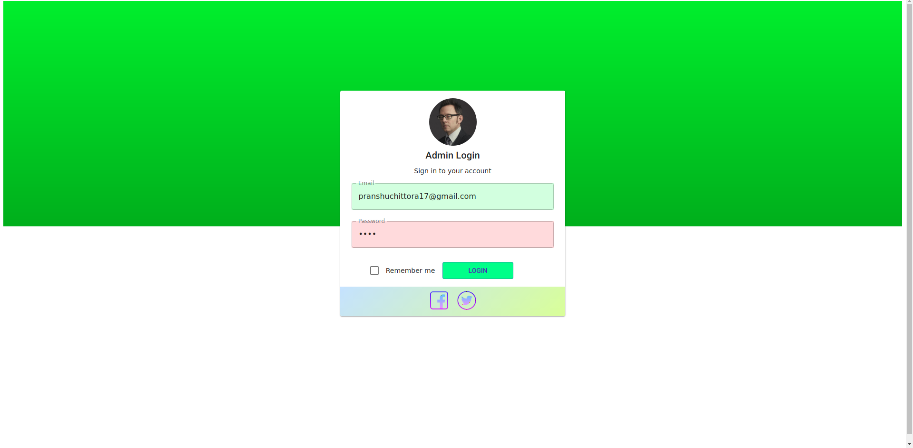
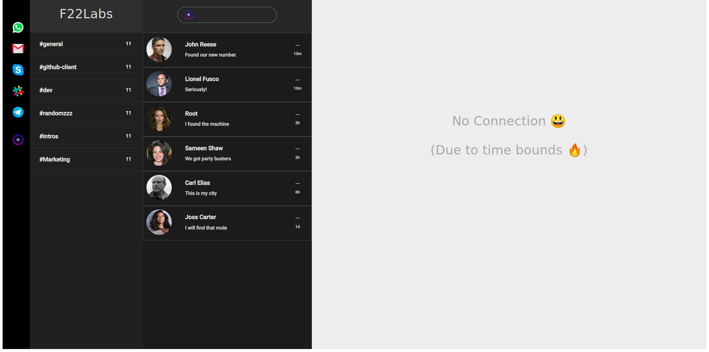

# F22Labs UI Test
Thanks for giving me an opportunity to prove myself.

## How to run the code

To install node_modules

`yarn` 

To run the dev server

`yarn start`

To build using webpack

`yarn build`

If port 3000 is already in use then 

`fuser -i -k 3000/tcp` 

-------
## Features
- [x]  Login Page
- [x]  Validation
- [x]  React-router
- [x]  Dashboard Layout
- [x]  Social Icons
- [x]  Second Drawer
- [x]  People Cards
- [x]  Mock Messages
- [x]  Webpack

-------------

### Login Page

### Dashboard

## How I approached the task
- First I analysed all the components from the picture carefully.
- Then I prepared a mindmap for it.
- #Coding time :D
- I used React.js as UI library. >> CRA 
- Material UI React as the component library

## What I learnt
- How to write readable code
- How to build with webpack
- Some tooling
- And much much more.

